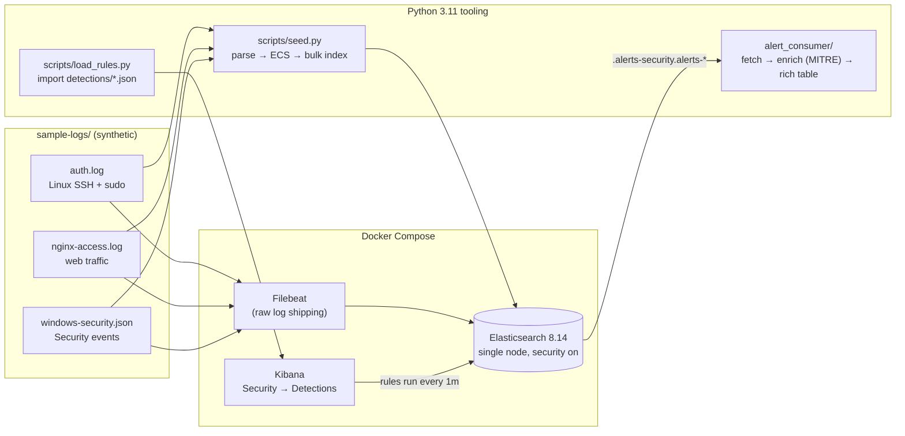
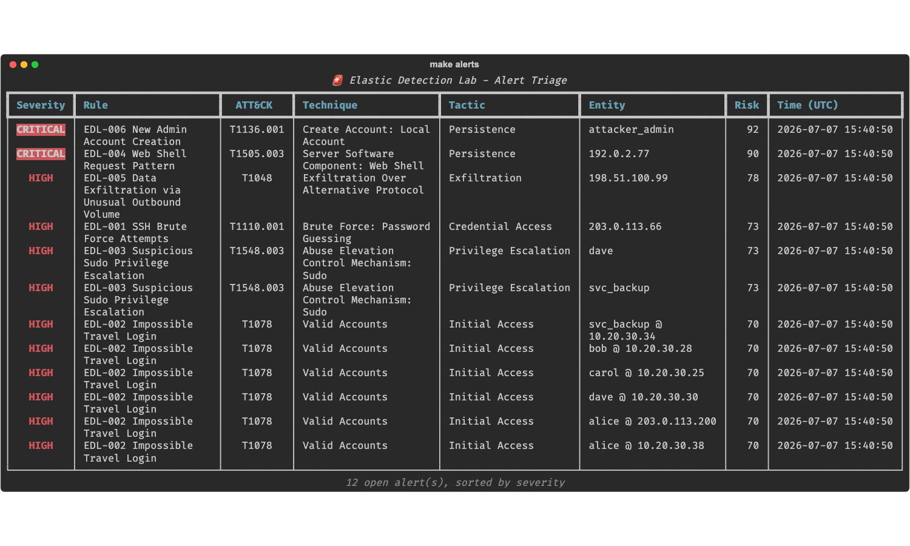
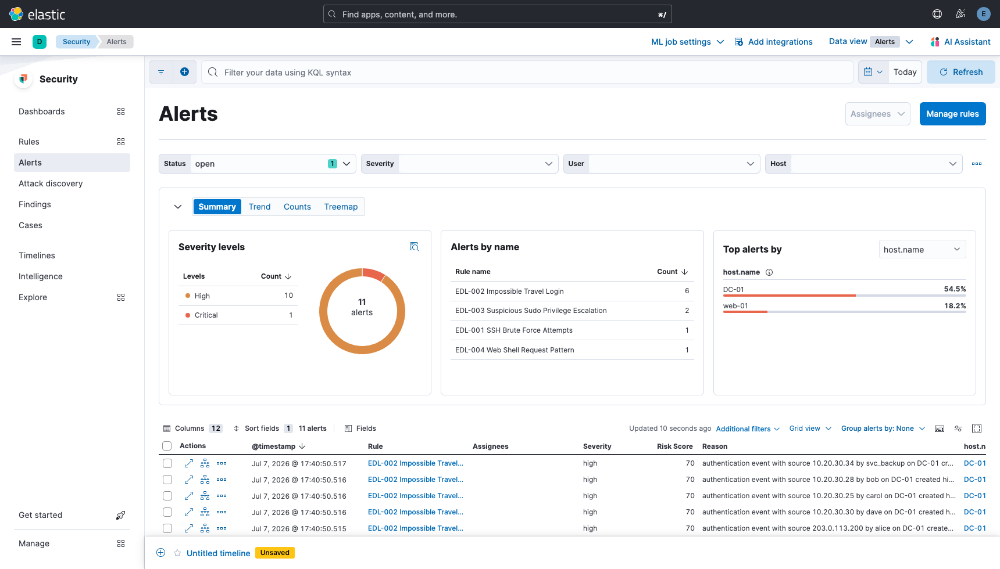
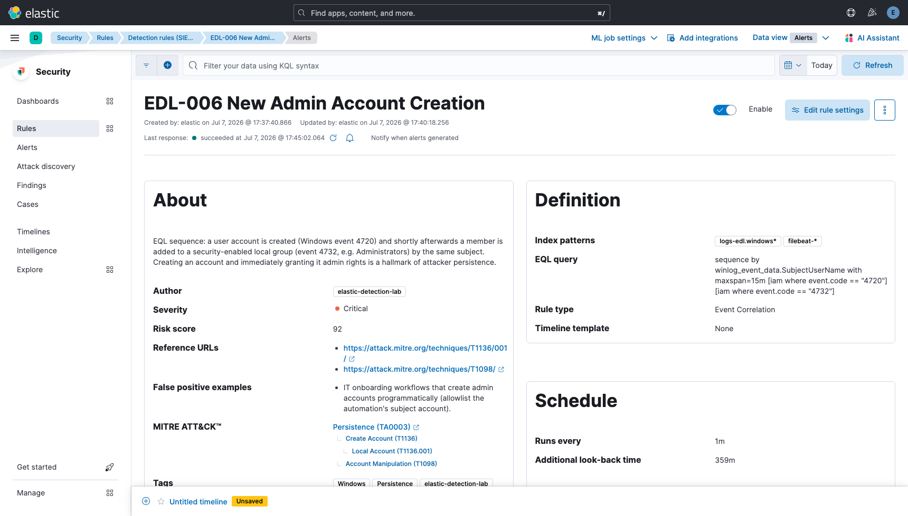

# 🛡️ elastic-detection-lab

**A self-contained detection engineering lab** - spin up a full Elastic Security stack with one
command, seed it with realistic attack telemetry, import six detection-as-code rules, and triage
the resulting alerts from a Python CLI.

Built to demonstrate the full detection engineering lifecycle: *log source → ingestion →
detection rule → alert → enrichment → triage*, with everything (rules, sample data, tooling,
MITRE mapping) versioned as code.


---

## Architecture



Two ingestion paths on purpose: **Filebeat** ships the raw lines (`filebeat-*`, the classic
pipeline), while **`seed.py`** indexes fully parsed [ECS](https://www.elastic.co/guide/en/ecs/current/index.html)
documents (`logs-edl.*`) that the detection rules query - and rebases timestamps to "now" so the
rules always have fresh events to fire on.

## Quick start - 3 commands

```bash
make up      # 1. start Elasticsearch + Kibana + Filebeat (first run pulls images)
make seed    # 2. generate logs, index them, import the 6 detection rules
make alerts  # 3. wait ~1 min for rules to run, then print the triage table
```

Then open **Kibana** at [http://localhost:5601](http://localhost:5601) → *Security → Alerts*.

> **Default credentials (lab use only):** `elastic` / `changeme`
> Override via environment: `ELASTIC_PASSWORD=... KIBANA_PASSWORD=... docker compose up -d`

Requirements: Docker (≥ 4 GB RAM allocated), Python 3.11+, `make`, `curl`.

### The triage table

`make alerts` (or `python -m alert_consumer`) queries the Elastic alerts API, enriches every
alert with its severity rank and MITRE ATT&CK technique, and renders a `rich` table:

```
                    🚨 Elastic Detection Lab - Alert Triage
┏━━━━━━━━━━┳━━━━━━━━━━━━━━━━━━━━━━━━━━━┳━━━━━━━━━━━┳━━━━━━━━━━━━━━━━━━┳━━━━━━┓
┃ Severity ┃ Rule                      ┃ ATT&CK    ┃ Entity           ┃ Risk ┃
┡━━━━━━━━━━╇━━━━━━━━━━━━━━━━━━━━━━━━━━━╇━━━━━━━━━━━╇━━━━━━━━━━━━━━━━━━╇━━━━━━┩
│ CRITICAL │ EDL-006 New Admin Account │ T1136.001 │ attacker_admin   │  92  │
│ CRITICAL │ EDL-004 Web Shell Request │ T1505.003 │ 192.0.2.77       │  90  │
│ HIGH     │ EDL-001 SSH Brute Force   │ T1110.001 │ 203.0.113.66     │  73  │
│ ...      │                           │           │                  │      │
└──────────┴───────────────────────────┴───────────┴──────────────────┴──────┘
```

## Screenshots

**Triage CLI** (`make alerts`):



**Kibana Security → Alerts** - severity breakdown and alert stream:



**Rule detail** - EQL definition and native MITRE ATT&CK mapping:



Regenerate them anytime with `.venv/bin/python scripts/capture_screenshots.py`
(needs `pip install playwright && playwright install chromium` and a seeded stack).

## Detections

All six rules live in [`detections/`](detections/) as importable JSON (bundled to NDJSON and
posted to Kibana's `_import` API by `scripts/load_rules.py`). Full ATT&CK table in
[`MITRE_MAPPING.md`](MITRE_MAPPING.md).

### EDL-001 · SSH Brute Force Attempts - `threshold` / KQL · **high**
Counts failed SSH password events (`event.outcome:failure`) grouped by `source.ip`; fires at
**≥ 10 failures** that also span **≥ 2 distinct usernames** (the cardinality clause suppresses a
single user fat-fingering their own password). The sample data contains a 40-attempt spray from
`203.0.113.66` cycling `root`/`admin`/`oracle`/…, followed by a successful login - the classic
brute-force-then-compromise sequence.

### EDL-002 · Impossible Travel Login - `new_terms` / KQL · **high**
Uses Kibana's *new terms* rule type on the pair (`user.name`, `source.geo.country_name`): a
successful login (event 4624) from a country **never seen for that user in the last 7 days**
fires an alert. In the sample data `alice` logs in from Madrid and, nine minutes later, from
Singapore - a pairing no amount of legitimate travel explains.

### EDL-003 · Suspicious Sudo Privilege Escalation - `query` / KQL · **high**
Two behaviors in one rule: (a) **service accounts** (`svc_*`) using sudo to spawn interactive
shells or read `/etc/shadow` - service accounts should only ever run their scripted commands -
and (b) any `user NOT in sudoers` policy violation. The samples show a compromised `svc_backup`
running `sudo /bin/bash` and `sudo cat /etc/shadow` right after the brute-force success.

### EDL-004 · Web Shell Request Pattern - `query` / KQL · **critical**
Matches requests to well-known shell filenames (`shell.php`, `c99.php`, `wso.php`, `b374k`) or
any `.php` resource invoked with command-execution parameters (`cmd=`, `exec=`, `eval`,
`base64`). The samples include a probe sequence ending with a live shell at
`/uploads/avatar.php?cmd=cat+/etc/passwd` returning 200.

### EDL-005 · Data Exfiltration via Unusual Outbound Volume - `threshold` / KQL · **high**
Flags a single `source.ip` receiving **≥ 5 responses over 10 MB each** inside the rule window -
sustained oversized transfers to one client are the signature of bulk export scraping. The
samples show `198.51.100.99` pulling twelve 45–95 MB responses from `/api/v1/export`.

### EDL-006 · New Admin Account Creation - `eql` sequence · **critical**
EQL correlation: account creation (**4720**) followed within **15 minutes** by a member added to
a security-enabled group (**4732**), joined on the same subject account. Create-then-elevate is a
hallmark of attacker persistence; the samples show `svc_backup` creating `attacker_admin` and
adding it to `Administrators` 42 seconds later.

## Repo structure

```
elastic-detection-lab/
├── docker-compose.yml          # ES + Kibana + Filebeat, single node, security on
├── Makefile                    # up / down / seed / alerts / test / clean
├── filebeat/filebeat.yml       # raw log shipping config
├── sample-logs/                # synthetic telemetry (regenerate: scripts/generate_logs.py)
│   ├── auth.log                #   Linux SSH + sudo (syslog format)
│   ├── nginx-access.log        #   web traffic (combined format)
│   └── windows-security.json   #   Windows Security events (NDJSON)
├── detections/                 # 6 detection rules as code (KQL / EQL / new-terms)
├── scripts/
│   ├── generate_logs.py        # deterministic synthetic log generator
│   ├── seed.py                 # parse → ECS docs → bulk index (rebases timestamps)
│   └── load_rules.py           # bundle rules → NDJSON → Kibana _import API
├── alert_consumer/             # alert triage CLI (elasticsearch + rich)
│   ├── consumer.py             #   fetch alerts, render table
│   └── enrich.py               #   severity + MITRE ATT&CK enrichment
├── tests/test_enrich.py        # pytest suite incl. rules↔mapping consistency check
├── MITRE_MAPPING.md            # full ATT&CK coverage table
└── LICENSE                     # MIT
```

## Development

```bash
make test          # run the pytest suite (enrichment logic, no stack needed)
make logs          # tail stack logs
make down          # stop, keep data
make clean         # stop, wipe data volume and venv
python scripts/generate_logs.py   # regenerate sample logs (seeded, reproducible)
```

Re-running `make seed` is idempotent: indices are recreated, rules re-imported with
`overwrite=true`, and timestamps rebased so alerts fire again.

## Disclaimer

All log data is **synthetic**, generated by [`scripts/generate_logs.py`](scripts/generate_logs.py)
with a fixed seed. IPs come from RFC 5737 documentation ranges; no real systems, users, or
incidents are represented. This lab is for learning and demonstrating defensive detection
engineering.

## License

[MIT](LICENSE)
